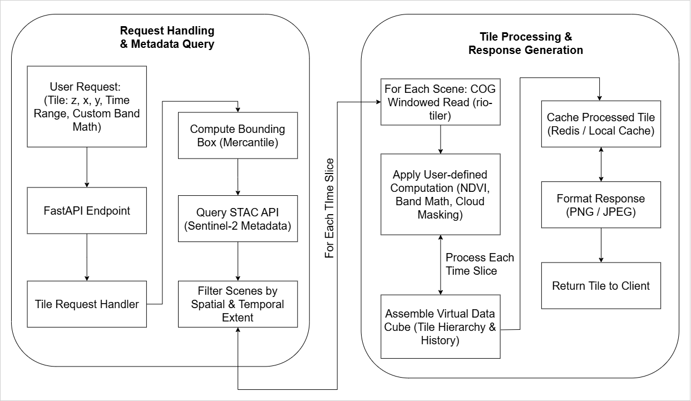

# Summary

**virtughan** is a Python-based geospatial data pipeline designed for on-the-fly computations on raster tiles. By leveraging Cloud-Optimized GeoTIFFs (COGs) and SpatioTemporal Asset Catalog (STAC) endpoints [@stacspec], virtughan enables real-time data processing across multiple zoom levels and time dimensions. virtughan focuses on on-demand tile computation, dynamically computing results as needed while minimizing data transfers and infrastructure overhead for entire scenes [@rio-tiler; @mercantile]. This cost-effective approach ensures that only the necessary tiles (i.e., bounding boxes of interest) are retrieved, with computations applied directly during data access [@sentinel2cogs]. The framework supports user-defined band math, multi-temporal analyses, and partial reads from Cloud-Optimized Sentinel-2 data, along with a caching mechanism to optimize repeated requests [@fastapi]. Ultimately, virtughan provides a scalable, open-source platform for modern geospatial data analytics, offering efficient, and real-time processing. Its optimized tile-based computation allows it to run efficiently even on minimal hardware, making large-scale satellite imagery processing more accessible for researchers, analysts, and developers.

# Statement of Need

Big Earth Data, with its high-resolution, multi-temporal satellite imagery, poses growing challenges for storage and real-time processing, often exceeding traditional workflows' capacities [@Sudmanns:2019]. As EO data volumes expand, efficient management strategies are needed to address rising computational and storage demands. Data cubes have emerged as a structured approach to managing large-scale EO datasets, facilitating efficient data access and analysis through precomputed storage architectures [@Giuliani:2019]. However, data cubes often store pre-aggregated or processed data layers, which can lead to increased storage requirements and may not support real-time data updates effectively. This approach can result in inefficiencies, as the storage of multiple processed layers extends the storage burden. Additionally, pre-computation is done on entire images rather than individual tiles, storing pre-aggregated layers for later analysis [@Sudmanns:2019]. This approach improves query efficiency but also increases memory usage and computational load, potentially allocating resources to areas that may not always be relevant. While cloud-based EO platforms like Google Earth Engine offer scalable solutions, they require significant infrastructure, limiting accessibility. Also, Downloading images within a user's area of interest is often time-consuming, as platforms like Copernicus Browser typically require downloading the entire image.

virtughan was designed to overcome these challenges by providing a scalable and efficient solution. It optimizes data processing by retrieving and computing only the necessary image tiles on demand, minimizing storage needs and computational overhead. This enables efficient, real-time analysis at multiple zoom levels while eliminating the need for large-scale precomputed datasets. By prioritizing computation over storage, virtughan provides a lightweight, scalable, and cost-effective alternative to traditional EO data cubes and cloud-based processing and data download platforms.

## Implementation

### Tile Requests and Partial Reads

A user or front-end requests map tiles via `(z, x, y)` coordinates (along with an optional date/time range and custom band math). Using mercantile’s approach[@mercantile], virtughan determines the tile’s bounding box. It then queries Sentinel-2 STAC metadata to identify scenes covering that region. Via the Cloud-Optimized GeoTIFF specification [@sentinel2cogs], windowed reads fetch only the portion of the image corresponding to the requested tile [@rio-tiler].

### On-the-Fly Computation

Once partial reads are loaded, virtughan applies user-defined formulas or filters (e.g., NDVI, cloud masking) per pixel. Because all computations occur at tile-creation time, the framework can flexibly incorporate new formulas or data corrections without reprocessing entire scenes.

### Caching and Scaling

The processed tiles (e.g., PNG or JPEG) can be cached. If an identical tile request recurs, virtughan serves it directly from the cache—improving performance and lowering bandwidth usage. As zoom levels shift, the system adjusts how the partial reads are resampled, ensuring minimal repeated data access.

### Download Images within Area of Interest

virtughan allows the users to download the images within their area of interest instead of downloading the whole image. The area of interest can be a polygon, rectangle, or a map window. The original level-2A images can be downloaded by filtering bands, date, and cloud cover. If multiple images fall within the selected time range and area, all relevant images captured at different time are retrieved. These downloaded images can further be visualized and analyzed using tools like QGIS and other geospatial applications.

# Performance Comparison

To demonstrate the efficiency of virtughan, we compared its performance against the Sentinel Image Downloader QGIS plugin. The evaluation measured the time required to visualize Sentinel-2 indices (e.g., NDWI) for specific Areas of Interest (AOI).

| Area of Interest  | Virtughan (s) | Sentinel Downloader (s) |
| :---------------- | :-----------: | :---------------------: |
| Fewa Lake, Nepal  |      84       |          1283           |
| Kathmandu, Nepal  |      219      |          1744           |
| Salzburg, Austria |      50       |           559           |

_Table 1: Time comparison for data visualization. Virtughan computes tiles on-the-fly, whereas the traditional approach requires downloading full scenes._

The traditional workflow (Sentinel Image Downloader) necessitates downloading full scene bands before calculating indices. For AOIs located in scene overlaps (e.g., Fewa Lake), this requires downloading multiple full scenes. In contrast, virtughan processes only the requested tiles, significantly reducing data transfer and processing time. Note that these measurements exclude authentication (CDSE login) and polygon extraction times.

_Figure 2: Performance comparison chart._

# Figures

# Application Areas

virtughan enables real-time geospatial data processing for various Earth observation applications. It helps monitor environmental changes like deforestation, glacial lake expansion, urban heat islands, and wildfires without requiring extensive data storage. In disaster response, it provides rapid analysis of floods, landslides, cyclones, and earthquakes. Urban planners can analyze land use, infrastructure growth, and air quality. AI integration on virtughan obtained datasets can support automated land classification, object detection, and biodiversity tracking. It also aids security efforts, including border monitoring and conflict damage assessment. As an open-source platform, virtughan enhances accessibility for citizen science, environmental advocacy, and academic research.

## Future Directions

virtughan already enables users to retrieve and process only the necessary image tiles on demand, reducing storage and computational overhead. To further enhance its capabilities, several key improvements are planned, enabling virtughan to integrate more data sources, and support advanced analytics while maintaining its lightweight framework.

- **Mosaicking**: Automating multi-scene merges for larger coverage areas.
- **Additional Sensors**: Adding Landsat, MODIS, and commercial satellite data.
- **Plugins and ML Integration**: Allowing advanced user-defined band math or machine-learning inference models for on-the-fly classification.
- **Distributed Caching**: Supporting scalable deployments for high-traffic or cluster-based environments.

These future developments will increase virtughan’s flexibility, efficiency, and usability, making large-scale Earth observation data processing more accessible and effective across various domains.

# Acknowledgments

We extend our gratitude to the maintainers of foundational GIS libraries such as Rasterio [@rasterio], rio-tiler [@rio-tiler], Mercantile [@mercantile], and FastAPI [@fastapi]. Additionally, we are grateful to our colleagues and mentors at the Copernicus Masters in Digital Earth program, co-funded by the European Union and hosted at Paris Lodron University of Salzburg, for their valuable insights and support. A special thanks to Professor Dirk Tiede and Dr. Martin Sudmanns for their guidance on existing data cube methodologies.

# References
